<div align="center">

<h3><code>quantume1@github ~ $ ./contributions.sh</code></h3>



<br><br>

<h3><code>quantume1@github ~ $ whoami</code></h3>

<table>
  <tr>
    <td valign="top"></td>
    <td valign="top"></td>
  </tr>
</table>

<br><br>

<h3><code>quantume1@github ~ $ ./stats.sh</code></h3>

<table>
  <tr>
    <td valign="top"></td>
    <td valign="top"></td>
  </tr>
</table>

<br>



<br><br>

<h3><code>quantume1@github ~ $ _</code></h3>

</div>

<!-- ------------------------------------------------------------------ -->

<details>
<summary><b>How this README works</b></summary>

<br>

GitHub strips `<script>` from READMEs and sanitizes almost all inline CSS — but
it *does* render SVGs embedded via ``, and it runs both their SMIL and
their CSS-keyframe animations. So all the motion lives inside self-contained
SVG files, and the README just places them. No JavaScript, no third-party stats
service, and nothing rendering on someone else's server.

| File | What it is | Regenerated |
| --- | --- | --- |
| `contrib-heatmap.svg` | Real 53×7 contribution calendar, revealed diagonally | Daily, by Actions |
| `streak.svg` | Current and longest streak, with date ranges | Daily, by Actions |
| `langs.svg` | Top languages by bytes, as a stacked bar | Daily, by Actions |
| `year.svg` | The year at one character per day, on the portrait's ramp | Daily, by Actions |
| `ascii-portrait.svg` | Photo → monochrome ASCII that types itself in | Locally, when the photo changes |
| `info-card.svg` | neofetch-style panel, fades in line by line | Locally, when `data/profile.json` changes |

### Layout

Images sit in `<table>` rows — the only reliable way to put two on one line on
GitHub. The full-width graphics are `860`, which equals the two portrait
columns (`370 + 490`) and the two stat cards (`425 + 425` plus cell padding),
so every edge lines up.

Markdown gotchas that are easy to lose time to:

- **Inline `style` is stripped.** `style="margin-top:36px"` does nothing. The
  only vertical spacing GitHub honors is `<br>`.
- **`<h1>` and `<h2>` draw a full-width underline rule.** Great as a divider,
  distracting as a title — use `<h3>` when you don't want the line.
- **No JavaScript, and external CSS is blocked.** The animation has to live
  entirely inside each SVG.
- **Embedded SVGs can't see the reader's theme.** Each one paints its own dark
  terminal background, so it reads identically in light and dark mode.
- **A new profile README is cached.** If it doesn't appear on your profile,
  edit it once through the web UI to force a refresh.

### Animation that fails safe

Every graphic is written so that a renderer which ignores the animation shows
the **finished** state, not a blank one. That is not the obvious way round: the
natural thing is to set `opacity:0` and animate up to 1, which leaves an empty
panel anywhere the animation doesn't run.

- CSS graphics use `animation-fill-mode: backwards` and never set `opacity:0`
  in a base rule. During the delay the element takes the keyframe's
  from-state; afterwards it falls back to its own visible style.
- SMIL has no equivalent of `backwards`, so the portrait's clip rects carry
  their **full** width as the base value. A `<set>` collapses them to 0 at
  `t=0`, and the `<animate>` — later in document order — takes over at its
  begin time. Without the `<set>`, the base value shows before `begin` and the
  portrait flashes whole, then blinks out row by row.

### The font, and the 0.600 em trap

The ASCII grid assumes a character advance of exactly **0.600 em**. Liberation
Mono, DejaVu Sans Mono and Noto Sans Mono all measure 0.600 — but Consolas,
which is what a Windows reader's `monospace` usually resolves to, is nearer
0.55, which would render the portrait several percent narrower than intended.

An external font URL cannot fix this: these SVGs load through ``, and
browsers refuse subresource fetches for image documents. A `@font-face` with a
**base64 data URI** does work, since nothing is fetched. Each SVG therefore
carries its own subset, built from exactly the characters that file paints —
13 glyphs for the portrait ramp (~1 KB), a few dozen for the cards.

Liberation Mono is SIL OFL 1.1; `fonts/LICENSE.txt` travels with it. Every row
also still carries `textLength`, so the geometry survives even if the embedded
face fails to load.

### Setup

```bash
python -m venv .venv && source .venv/bin/activate
pip install -r scripts/requirements.txt
make test          # parser selftest, no network
```

### Where the numbers come from

`fetch_stats.py` has two paths and writes the same `data/stats.json` either way:

- **GraphQL**, when a token is present. Typed and stable, and the only way to
  get language bytes and repo counts. In Actions the built-in `GITHUB_TOKEN`
  is enough — no personal access token.
- **HTML scrape** of the public contributions page, needing no auth at all.
  Used when there's no token, and as a fallback if GraphQL fails, so an API
  outage degrades the data rather than blanking the graph. `source` in the
  JSON records which path ran.

Private contributions: your profile calendar can include them if you've opted
in, but the Actions token only sees what any signed-in user sees, so the
GraphQL totals are public-only. Set a `PROFILE_TOKEN` secret to a PAT with
`read:user` if you want them counted.

Two things are pinned for determinism, because this runs nightly and commits
its own output:

- **The window is whole UTC days.** Left alone, `contributionsCollection`
  measures back from the moment of the request, so two runs minutes apart
  bucket days into different weeks and the graph shifts — producing a commit
  every night that encodes nothing but the clock.
- **Repositories are filtered to `privacy: PUBLIC`**, so the language
  percentages don't depend on whose token ran the query.

### Regenerating the portrait

Deliberately two steps: prep the photo once, then convert it.

```bash
pip install -r scripts/requirements-portrait.txt
make portrait
```

`prep_photo.py` uses `rembg` for background removal and OpenCV's CLAHE when
they're installed, and falls back to a border flood-fill and a pure-numpy CLAHE
when they're not. Two flags matter most:

- `--strength` — how far to blend toward the CLAHE result. CLAHE on its own
  wrecks large flat dark areas: a tile that's nearly all black holds only a
  sliver of variation, and equalising it stretches that sliver across the full
  range, turning a black hoodie into a white one.
- `--white-point` (on `make_ascii_svg.py`) — snaps near-white to pure white so
  the background lands on the space glyph. Too low and the face fills with
  glyphs and the features stop reading.

The flood-fill also rejects any edge pixel that doesn't match the median border
colour, because on a bust shot the bottom corners are *shoulder*, not backdrop —
seeding there floods the whole garment and erases it.

`make_ascii_svg.py --print-text` dumps the grid to stdout, which is the fastest
way to tune either flag.

The default pairing composites onto **white** and maps dark → dense, so hair,
glasses and hoodie become the ink. The inverse also works —
`prep_photo.py --background black` with `make_ascii_svg.py --invert` makes glyph
density track emitted light, which is tonally closer to the photo but reads
fainter at profile size.

### Regenerating the card

Edit `data/profile.json`, then `make card`. Keep the story here and the numbers
in the graphics — the graph already covers the stats, so the card is for what
numbers can't say.

### Previewing locally

Every generator takes `--static` (or `STATIC=1`) to emit a frozen frame, which
is what you want for a local look — animations only play from the start on a
fresh load.

```bash
make preview        # writes .preview/index.html
```

</details>
